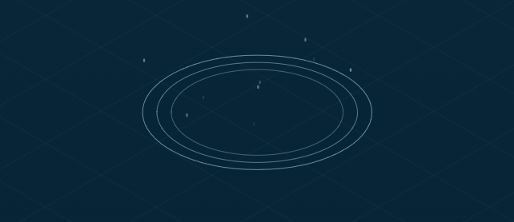

# Isometric Rain & Ripples — README

Việt Nam / English (below)

---

PHẦN VIỆT (tóm tắt)

Mô tả ngắn:

- Một trang HTML đơn-file mô phỏng mưa, gợn sóng và splash trên mặt nước sử dụng Canvas 2D với phối cảnh isometric (góc 30°).

Chạy nhanh:

- Mở `index.html` trong trình duyệt (kéo thả hoặc File → Open). Không cần phụ thuộc ngoài.

Phím tắt chính:

- Space — bật/tắt mưa tự động (auto rain)

- M — bật/tắt hiển thị menu / overlay

- Click — spawn cụm mưa tại vị trí chuột (Shift ×3, Ctrl ×0.5)

- Wheel — tăng/giảm Drops/sec

- Checkbox: bật/tắt "Spawn on hover"

Các công thức / thuật toán chính (tóm tắt):

Phối cảnh isometric (theta = 30°):

```text
sx = (x - y) * cos(theta)
sy = (x + y) * sin(theta) - z
(theta = π/6, cos≈0.866, sin≈0.5)
```


Chiến lược spawn tự động (accumulator):

```js
accumulator += dropsPerSec * dt;
while (accumulator >= 1) { spawnDrop(); accumulator -= 1; }
```

Phương pháp gần đúng để chuyển màn hình → thế giới (click/hover):

```text
sx = clientX - rect.left - canvas.clientWidth/2
sy = clientY - rect.top - canvas.clientHeight*0.45
wx = (sx / COS + sy / SIN) / 2
wy = (sy / SIN - sx / COS) / 2
```

Ripple (tham số):

```js
life = (1.8 + random(0,0.8)) * config.rippleLife;
speed = (220 + random(0,80)) * config.rippleSize;
maxR = speed * life;
// alpha fade ≈ (1 - t)^2  (t = age / life)
```



Splash particle count (khi drop chạm):

```js
count = round((4 + floor(random*6)) * (config.splashCount / 6));
```


Hover spawn (tỉ lệ so với click):

```js
hoverCount = max(1, round(clickSpawnCount * 0.06));
```

FPS smoothing (cập nhật mỗi 200ms):

```js
fpsSmoothed = fpsSmoothed * (1 - alpha) + rawFps * alpha; // alpha = 0.15
```

Thiết kế lưu ý:

- `config` là nguồn dữ liệu duy nhất cho trạng thái có thể chỉnh.

- Khi trang tải, tạo `initialConfig = JSON.parse(JSON.stringify(config))` để Reset trả về snapshot ban đầu.

Tác giả:

- [TranDat1114](https://github.com/TranDat1114)

---

ENGLISH (summary)

Short description:

- Single-file HTML simulation of isometric rain, surface ripples and splash particles using Canvas 2D.

Quick run:

- Open `index.html` in any modern browser. No external dependencies.

Keyboard shortcuts:

- Space — toggle automatic rain (autoRain)

- M — toggle overlay/menu visibility

- Click — spawn a burst at mouse (Shift ×3, Ctrl ×0.5)

- Mouse wheel — adjust drops/sec

- Toggle "Spawn on hover" via the checkbox

Algorithms & formulas:

Isometric projection (θ = 30°):

```text
sx = (x - y) * cos(θ)
sy = (x + y) * sin(θ) - z
```


Auto-spawn accumulator (per frame dt):

```js
accumulator += dropsPerSec * dt;
while (accumulator >= 1) spawnDrop();
```

Approximate screen → world mapping used for clicks/hover spawns:

```text
sx = clientX - rect.left - canvas.clientWidth/2
sy = clientY - rect.top - canvas.clientHeight*0.45
wx = (sx / COS + sy / SIN) / 2
wy = (sy / SIN - sx / COS) / 2
```

Ripple parameters:

```js
life = (1.8 + rand(0,0.8)) * rippleLife
speed = (220 + rand(0,80)) * rippleSize
maxR = speed * life
fade ≈ (1 - t)^2
```


Splash particle count (khi drop chạm):

```js
count = round((4 + floor(random*6)) * (config.splashCount / 6));
```


Hover spawn scale:

```js
hoverCount = max(1, round(clickSpawnCount * 0.06))
```

FPS smoothing (EMA):

```js
fpsSmoothed = fpsSmoothed*(1 - α) + rawFps*α  (α = 0.15)
```

Notes:

- The runtime state is held in the `config` object. `initialConfig` is a deep clone of the defaults and is used by Reset.

Author:

- [TranDat1114](https://github.com/TranDat1114)
